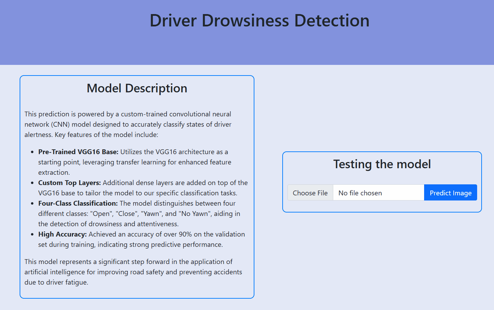

    

 

This project was developed as part of ENSE-412, a Machine Learning course within my engineering degree program. The Driver Drowsiness Detection System showcases the application of skills and knowledge acquired through my studies, reflecting a comprehensive approach to enhancing road safety by addressing the critical issue of driver fatigue.

 

    

 

  

 

    

 

This repository contains all the necessary components of the Driver Drowsiness Detection. This project aimed to  enhancing road safety by identifying signs of driver fatigue through image analysis. Utilizing machine learning algorithms and deep learning techniques, this system detects key fatigue indicators such as closed eyes and yawning.

 

    

 

  
  
  
  
  
  

 

    

 

- <b>DriverDrowsinessDetection.ipynb:</b> Jupyter notebook detailing the model development process, including the exploration of machine learning algorithms like Random Forest, K-Nearest Neighbor (KNN), and Decision Trees, culminating in the implementation of a Convolutional Neural Network (CNN) using the VGG16 architecture.
- <b>model.h5:</b> The saved final CNN model that can be used for making predictions.
- <b>index.html and app.py:</b> Files constituting a Flask web application for local demonstration of the project, which was used to as a demo in the class presentation.
- <b>requirements.txt:</b> A list of Python libraries required to run the local demo.

 

    

 

The final model utilizes the VGG16 architecture as a feature extractor. The pre-trained VGG16 model was employed to capture complex features from the images, which was then used by custom layers to perform classification. This approach leverages the powerful feature detection capabilities of VGG16 without additional training on my part.

